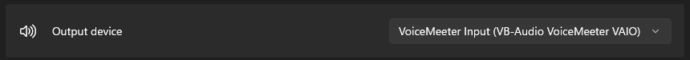
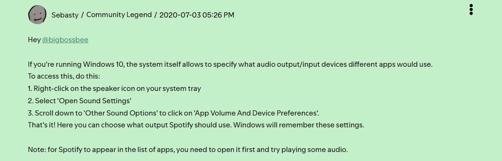
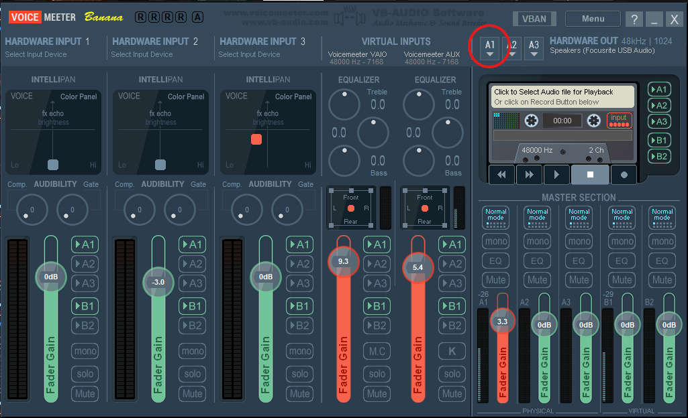
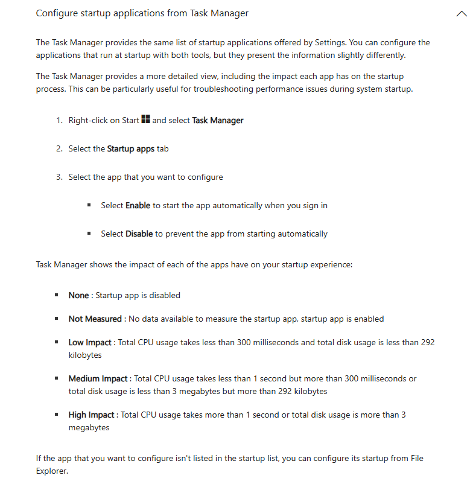
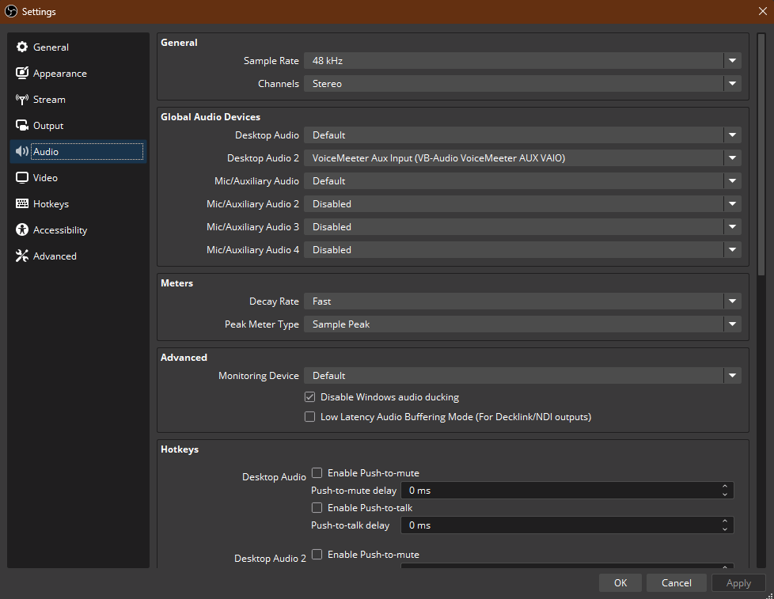
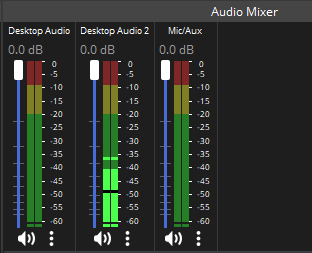
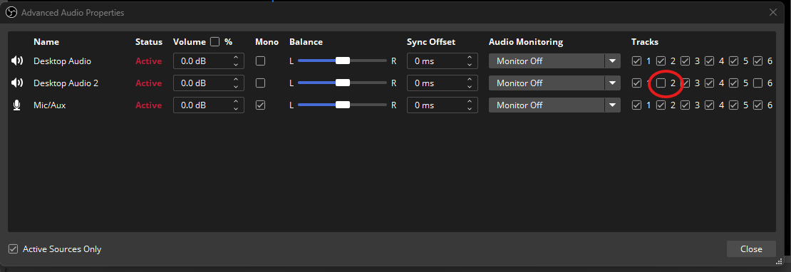

# Seperating Spotify from Twitch VOD

A guide to show how to seperate the spotify playback from the audio channel in OBS Studio to keep VODs from being muted and/or unpublished.

## Using Voicemeeter

The easiest path is to use a free software called [Voicemeeter Banana](https://vb-audio.com/Voicemeeter/banana.htm) which would make a Thotlita with banana cake shorts very happy. This program is a virtual mixer that can seperate voice channels and combine them as an output so you hear them both at the same time.

### Set your Windows Sound Output Device

Once downloaded, restart your PC to make sure the new virtual sound drivers are active. In Windows, open up your sound settings (click speaker bottom right). Make not of what your current output device is. Now set your default sound output device to "VoiceMeeter Input (VB-Audio Voicemeeter VAIO)

### Set Spotify to the Aux (Secondary) Input

The following image shows the steps in Windows 10 for setting Spotify to a different sound output. NOTE: System tray is the bottom right of the desktop in windows.

Set the output for Spotify to "VoiceMeeter Aux Input (VB-Audio VoiceMeeter AUX VAIO)

### Set Hardware out for VoiceMeeter Banana Cake

Open up VoiceMeeter Banana and click the A1 button towards the top righ (shown in image below) and select whatever your usual output is (USB headphones, Speakers, etc) which was changed away from earlier. 

Also make not of all the lit up A1 and B1 buttons on the bottom vertical mixing bars, you'll likely want to match those if they aren't the same by default. In the Virutal Inputs sections (the one with the orange bars in the screenshot), the right bar will be the volume of Spotify, the left bar with be the volume of everything else on your PC, so you can mix accordingly.

At this point, with VoiceMeeter already open, I recommend first of all pinning it to your Windows taskbar by right clicking it in the taskbar and clicking "Pin to taskbar".
Secondly, add the program to your startup programs by opening the task manager (CTRL + SHIFT + ESC), clicking the startup apps tab, finding VoiceMeeter (VB-Audio) in the list, right clicking on it then clicking "Enable". This makes it so you won't have to click the button to start it every time you boot up your PC.

### Set OBS Studio Audio Device

In OBS Studio, go to Audio settings and set "Desktop Audio 2" to "VoiceMeeter Aux Input (VB-Audio VoiceMeeter AUX VAIO)

This will add another bar in the Audio mixer part of OBS Studio that will strictly control the volume of Spotify to your live audience. You can adjust accordingly.  

### Set your Audio Tracks in OBS Studio

Right click the audio mixer part of OBS Studio and click Advanced Audio Properties. The picture below shows my 3 audio device track setups. The important part is to make sure 2 (or any other track if you're a huge nerd and need more than 2 tracks for some reason) is unchecked for "Desktop Audio 2", the Spotify device.

Now go to your OBS Studio settings, into the Output tab on the left, set Output Mode to Adcanced if it isn't already set to that (you may have to duplicate other stream settings from the Simple output mode, switching back and forth and matching the numbers should be sufficient) and set Audio Track to 1, click the checkbox next to the label "Twitch VOD Track" and select 2 next to it.

This will make it so that the VOD will use the second audio track which doesn't have the Spotify device selected, but the livestream will use the first audio track which does.

Now everyone can bop along to some awful Morgan Wallen or whatever his name is songs :]